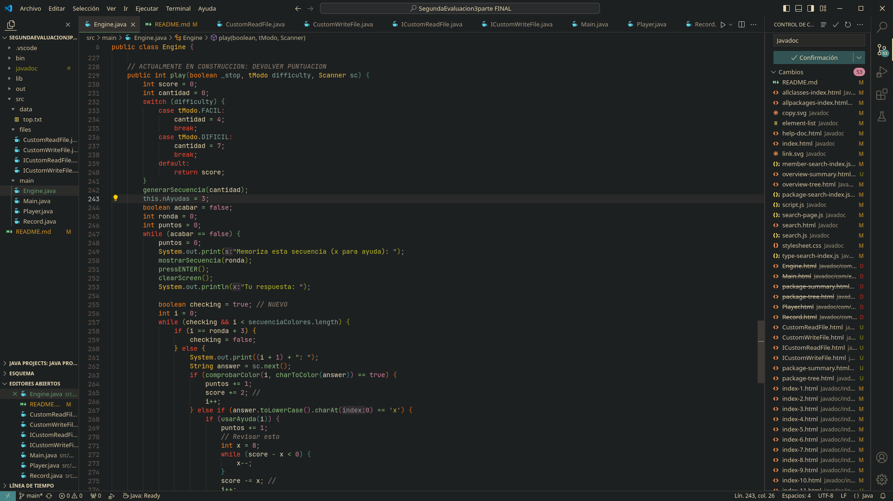

# SIMÓN DICE JAVA

## Descripción
**Autor**: Beltrán ***ZMiK0_*** González Martos.
**Basado en**: Documentación Proyecto Java Segundo Trimestre _Jonathan Carrero_.

Este es mi proyecto de la segunda evaluación de la asignatura de java construido con mi sudor y lágrimas.

## Documentación
El javadoc se encuentra en la carpeta "javadoc".

## Dependencias
- JDK21
- VSCode

## Instalación
Clona el repositorio y abrelo con VSCode.

## Imagen del Proyecto

